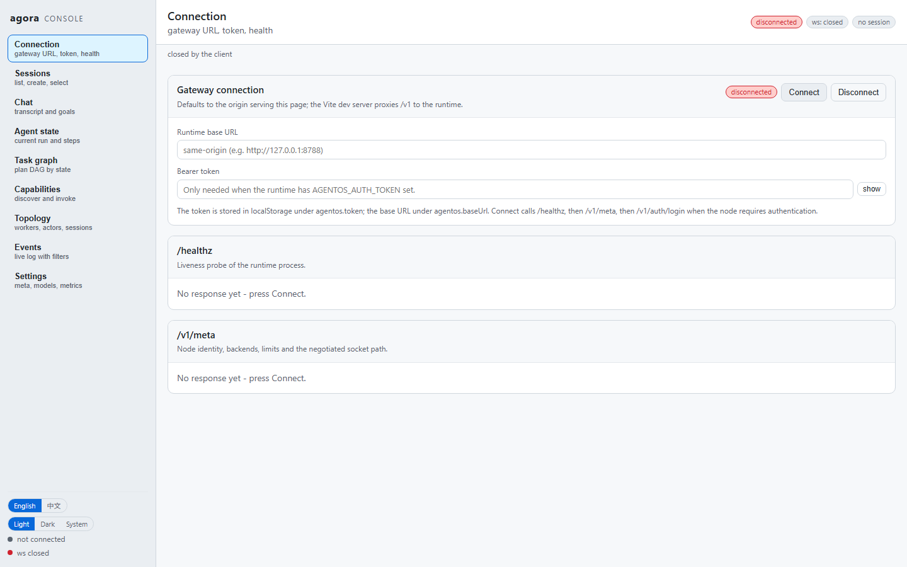
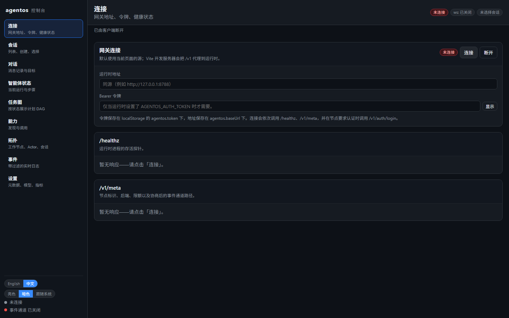

# Agora Agent OS - Distributed Agent Runtime

A runnable **Agent Operating System** skeleton: session actors, an agent loop, a capability mesh,
a task scheduler, durable state, an event log, artifacts, a model router, a Wasm sandbox, gRPC
and libp2p transports, a React/Tauri client and a CLI.

> Agent OS = Actor Runtime + Agent Loop + Capability Mesh + Task Scheduler + State/Memory +
> Artifact System + Model Router + Trust Plane

This is not a multi-agent demo. The point of the codebase is the **boundaries**: Agent != Model,
Agent != Process, Capability != Worker, control plane != data plane. Replacing a model, adding a
capability, migrating an actor or deploying a second node must not require rewriting the runtime.

---

## 1. Quick start (four commands)

```bash
# 1. build everything (Rust workspace)
cargo build

# 2. run the full acceptance scenario in one process and print a report
cargo run -p agentos-cli -- demo

# 3. start the runtime (HTTP/WS on :8788, gRPC on :8789)
cargo run -p agentos-server

# 4. (optional) the TypeScript control server and the web client / desktop shell
pnpm install
pnpm dev              # runtime + control server + web dev server
pnpm desktop          # Tauri 2 desktop shell
```

No API key is required: the runtime ships a deterministic offline provider, so the whole
acceptance suite and the demo run with no network. Add `DEEPSEEK_API_KEY` / `OPENAI_API_KEY` /
`DASHSCOPE_API_KEY` (or point `local` at an Ollama endpoint) to use a real model.

### Verified commands

| command | what it proves |
|---|---|
| `cargo test --workspace` | 123 tests across 35 suites: state machines, scheduler, policy, migration, gateway, gRPC, acceptance |
| `cargo run -p agentos-cli -- demo` | Goal -> LLM -> Capability -> Observation -> Final, two parallel sessions, snapshot/restore, migration |
| `cargo run -p agentos-cli -- doctor` | configuration, storage, capabilities, provider readiness |
| `cargo run -p agentos-server` | the one-command runtime: HTTP/WS + gRPC |
| `pnpm --filter @agentos/web build` | the client compiles (206 modules, ~149 KB gzipped) |
| language and theme switches | English/中文 and light/dark/system apply instantly, no reload |
| `pnpm dev` | runtime + TypeScript control server + web dev server in one command |
| `node apps/server/src/index.ts` | control server proxy, WebSocket fan-out, multi-session orchestration |
| `cargo check` in `apps/desktop/src-tauri` | the Tauri 2 desktop shell compiles |
| `agentos --remote <grpc> session create/message` | a CLI on one machine driving a runtime on another |
| `pwsh -File scripts/test.ps1` | everything above in one shot |
| `pwsh -File scripts/instances.ps1 new/start/status -Name a` | several isolated nodes on one machine |
| start two nodes, open one console | the other appears by itself in Discovered nodes (see 1c) |
| `GET /v1/sessions/{id}/export?format=markdown` | the whole conversation as a document, with what each run cost |
| `POST /v1/sessions/{id}/branch` | fork a session: inherits the conversation, then lives its own life |
| `node scripts/cdp-errors.mjs <cdp-endpoint> <console-url> <runtime-url>` | drives a headless browser through connect and the views, printing browser-side errors |

---

## 1b. Several instances on one machine

One physical machine can host any number of **independent nodes**: nothing in the runtime is
global except the ports. Data, workspace, event log, artifacts and memory are all relative to the
instance's working directory, so two instances started from two directories are fully isolated -
and they can be joined later through gRPC or the P2P plane if a cluster is what you want.

```bash
pwsh -File scripts/instances.ps1 new   -Name a      # allocates a free port pair, copies the binary
pwsh -File scripts/instances.ps1 new   -Name b
pwsh -File scripts/instances.ps1 start -Name a
pwsh -File scripts/instances.ps1 start -Name b
pwsh -File scripts/instances.ps1 status
```

Each instance gets its own directory:

```
instances/<name>/
  instance.json    identity + ports (node_id, node_name, http, grpc)
  config.json      optional: used as AGENTOS_CONFIG when present
  bin/             this instance's own copy of agentos-server
  data/            state store, event log, artifacts
  workspace/       the only directory its filesystem capabilities may touch
  run/             pid, stdout, stderr
```

**If a development process dies.** The supervisor decodes the exit code instead of printing a
number, because a number tells nobody anything: `0xC0000409` (3221226505) is a native
`__fastfail` - a V8 fatal error, a native stack overflow or an out of memory abort - `0xC000013A`
is Ctrl+C, `0xC0000005` an access violation. A crashed `web` or `control` child is restarted
once per second, at most three times a minute; the runtime is deliberately not restarted, because a
runtime that dies is a bug to look at rather than a condition to paper over. The console reconnects
on its own (exponential backoff), so a restarted dev server needs no page reload.

Doing it by hand is the same three variables, if you prefer your own process manager:

```bash
# terminal 1                                          # terminal 2
cd D:\nodes\a                                          cd D:\nodes\b
AGENTOS_NODE_ID=node-a \                              AGENTOS_NODE_ID=node-b \
AGENTOS_HTTP_ADDR=127.0.0.1:8788 \                    AGENTOS_HTTP_ADDR=127.0.0.1:8790 \
AGENTOS_GRPC_ADDR=127.0.0.1:8789 \                    AGENTOS_GRPC_ADDR=127.0.0.1:8791 \
agentos-server                                         agentos-server
```

What has to differ per instance, and why:

| setting | why |
|---|---|
| `AGENTOS_HTTP_ADDR` / `AGENTOS_GRPC_ADDR` | two listeners cannot share a port. The runtime now rejects identical addresses at startup instead of silently losing its gateway |
| `AGENTOS_NODE_ID` | the identity stamped on every event, directory entry and worker record. Normally you do not set it: an identity is generated on first start and kept in `<data_dir>/node.id`, so it is unique per instance and stable across restarts. Two nodes with the same *name* are still two nodes |
| `AGENTOS_HISTORY_MESSAGES` / `AGENTOS_HISTORY_CHARS` | how much of the conversation is replayed into each model request (default 20 turns / 8000 chars; `0` turns history off). Every request logs `task=.. messages=N`, and each run emits a `conversation history assembled` event, so "did the model see the previous turn?" is answerable from the log |
| `AGENTOS_COMPACTION` / `AGENTOS_COMPACTION_MIN_MESSAGES` | when turns leave the history window they are summarised once into a memory record instead of being dropped (default on, minimum 4 dropped turns; `off` disables). The summary is written, recalled and visible in the same turn, and the watermark lives in the actor state, so a restart or a migration never re-summarises turns it already paid for. Each compaction emits `session_compacted` and its cost is reported apart from the runs in `runtime.compaction_usage` |
| `AGENTOS_CONTEXT_FILES` / `AGENTOS_CONTEXT_FILES_CHARS` | project instruction files read from the workspace at the start of every run and prepended to the prompt (default `AGENTS.md`, 8000 chars). Comma separated; read through the workspace jail, so an entry that escapes the workspace is refused and logged rather than read. Editing the file takes effect on the next goal, and every run reports a `context_loaded` event with the files, size and whether the budget truncated them |
| `AGENTOS_MEMORY_RECALL_LIMIT` / `AGENTOS_MEMORY_RECALL_CHARS` | how many stored turn records may be recalled per run and how many characters may be injected (default 5 / 1200; `0` switches recall off). Recall only adds turns the recent-history window can no longer show - a record whose goal is still visible in the conversation is dropped - and each run emits a `memory_recalled` event with the injected size |
| `AGENTOS_NODE_NAME` | the human label shown in the console and the log. Two checkouts of the same repository share a directory name, so `pnpm dev` labels each stack `<directory>-<http port>`; the console appends the port when two nodes do end up with the same name |
| working directory | `./data` and `./workspace` resolve against it. Set `AGENTOS_DATA_DIR` / `AGENTOS_WORKSPACE_ROOT` explicitly if you would rather keep them elsewhere |

### The development stack in a second checkout

`pnpm dev` resolves its ports instead of assuming them, so a second checkout can be brought up
while the first is still running:

```bash
# first checkout                              # second checkout
pnpm dev                                      pnpm dev
                                              # [dev] runtime http port 8788 is busy, using 8791 instead
                                              # [dev] runtime grpc port 8789 is busy, using 8792 instead
                                              # [dev] control port 8790 is busy, using 8793 instead
                                              # [dev] web port 5173 is busy, using 5174 instead
```

Pin a port when you need a fixed one - a pinned port that is busy is a hard error, not a silent
shift: `RUNTIME_HTTP_PORT=8888 WEB_PORT=5180 pnpm dev`. The resolved ports are propagated to
whatever needs them (the Vite proxy target and the control server's `RUNTIME_URL`), so the shifted
stack is internally consistent rather than pointing at the other one's runtime.

Two operational notes learned the hard way:

* **Windows locks a running executable.** With N instances sharing one binary, `cargo build` fails
  with `os error 5` until they all stop. That is why each instance directory carries its own copy -
  and why instances can be pinned to different versions for a staged upgrade.
* **`AGENTOS_AUTH_TOKEN` is read per process.** Set it in an instance's environment only if that
  node should require a bearer token; anything set in the parent shell is inherited by every
  instance you start from it.
* **Never point two running instances at one data directory.** The file store has no cross-process
  lock: two writers keep independent event sequence counters and the last write wins. Different
  working directories give you different `./data` for free - if you would rather run two stacks
  from one directory, set `AGENTOS_DATA_DIR` per stack (the `pnpm dev` banner prints the data
  directory it resolved).

### 1c. Finding the other nodes

Starting a node is enough to be found. There is nothing to configure, no port to type and no
registry to run: each node writes a small JSON advertisement - identity, HTTP and gRPC endpoints,
capability names, whether it demands a token - into a per-user directory
(`%LOCALAPPDATA%\agora-agent-os\nodes` on Windows, `$XDG_RUNTIME_DIR/agora-agent-os/nodes`
elsewhere), refreshed every few seconds and expired by TTL. A node appearing or disappearing
becomes a `node_discovered` / `node_lost` event on the bus, and `GET /v1/nodes` returns the live
list.

The console shows it in the Connection view: every node it can see, with its address, capability
count and heartbeat age, and a Connect button that switches the console to it - one console,
several runtimes.

| setting | meaning |
|---|---|
| `AGENTOS_DISCOVERY=off` | neither advertise nor look for others |
| `AGENTOS_DISCOVERY_DIR` | use a different shared directory |
| `AGENTOS_DISCOVERY_TTL_MS` | how long an advertisement stays valid (default 10 s) |
| `AGENTOS_DISCOVERY_ADVERTISE=off` | look without being seen |

Identity and label are separate on purpose. The identity is generated per data directory and
persisted, so nothing has to be configured for two nodes to be told apart; the name is only what a
human reads. Deriving identity from the name - as the first version did - made two default nodes
advertise under one identity and skip each other as "myself", which is exactly the case a
zero-configuration feature has to get right.

Why a directory rather than multicast: two checkouts are two processes owned by the same user, so a
per-user directory is a rendezvous that needs no network, no firewall exception and no
configuration - and it is inspectable, which matters when a node does not show up. Discovery is a
hint and never sits on the request path: a stale advertisement expires, a corrupt one is skipped,
and a node that is gone is simply no longer listed.

Cross-machine discovery is the libp2p/mDNS backend behind the same `NodeDiscovery` trait; the
composition root selects the backend, so switching or combining them is wiring, not redesign.

Independence is the default; a cluster is a later step. Today the shared pieces are discovery, the
gRPC clients (a CLI on one machine can drive another node: `agentos --remote <grpc> ...`) and the
P2P plane. Cross-node placement and `ActorTransfer` are interfaces with a local implementation, so
a multi-node deployment does not require rewriting the runtime.

---

## 2. Repository layout

```
agora-agent-os/
├── Cargo.toml                     Rust workspace
├── package.json / pnpm-workspace.yaml
├── crates/
│   ├── core/                      IDs, domain model, state machines, errors, config, telemetry
│   ├── storage/                   Store / BlobStore / ArtifactStore + memory, file, redb backends
│   ├── event-bus/                 ordered, replayable event stream
│   ├── actor-runtime/             typed mailboxes, checkpoints, migration pipeline
│   ├── task-scheduler/            task graph, parallel execution, retry, cancel
│   ├── capability-runtime/        Capability trait, registry, mesh, policy seam, built-ins,
│   │                              workspace jail, JSON-Schema validation, remote transport seam
│   ├── model-router/              ModelProvider trait + DeepSeek/OpenAI/Qwen/local/mock adapters
│   ├── control-plane/             Actor Directory, Worker Registry, Placement, Policy engine
│   ├── agent-runtime/             SessionActor, AgentLoop, MemoryStore, SessionManager
│   ├── wasm-runtime/              Wasmtime sandbox, JSON ABI, host functions, epoch timeouts
│   ├── network/                   gRPC server/clients (proto/), libp2p node, discovery
│   ├── kernel/                    COMPOSITION ROOT: wires every plane, gRPC adapters
│   ├── api/                       HTTP + WebSocket gateway (auth, rate limit, correlation)
│   ├── cli/                       agentos binary
│   └── server/                    agentos-server binary
├── proto/agentos/v1/              common, capability, control, agent service contracts
├── capabilities/                  built-in docs + wasm examples (echo.wat, spin.wat)
├── apps/
│   ├── web/                       React + TypeScript + React Flow client
│   ├── desktop/                   Tauri 2 shell around the same client
│   └── server/                    Node control server: proxy, WS fan-out, TS orchestration
├── scripts/                       dev.mjs, demo.ps1, test.ps1, instances.ps1
├── instances/                     per-instance run directories (gitignored, created by the script)
├── tests/                         cross-crate acceptance and gateway test suites
└── docs/                          architecture, migration, decisions, api
```

`crates/kernel` is the one addition to the suggested layout: a composition root. Without it, either
the gateway or the binary would have to know every concrete backend, which is exactly the coupling
this design avoids. See `docs/decisions.md` D1.

---

## 3. Architecture in one page

```
Gateway (crates/api)          auth - rate limit - request id - session routing - WS fanout
        |
Control Plane (crates/control-plane)     Placement - Actor Directory - Workers - Policy
        |                                 consulted ONLY on cache miss / migration / recovery
Agent Runtime (crates/agent-runtime)      SessionManager -> SessionActor -> AgentLoop
        |                                     Goal -> Plan -> Act -> Observe -> Finalize
   +----+----------------+------------------+
   |                     |                  |
Task Scheduler     Capability Mesh     Model Router
   |                     |                  |
Data Plane: Actor Runtime - Wasm Sandbox - Workers - P2P - Blobs
   |
State: Store (memory|file|redb) - Event Bus - Artifacts - Memory
```

Details, including the full request path and the failure model: `docs/architecture.md`.

### The entities and their lifecycles

Every entity has its own id type and its own explicit state machine - no booleans model lifecycle
anywhere in the codebase (`crates/core/src/state.rs`).

| entity | id | states |
|---|---|---|
| Session | `ses_*` | creating, active, idle, suspended, closing, closed, failed |
| Actor | `act_*` | spawning, active, idle, draining, migrating, stopped, failed |
| Agent run | `agt_*` | goal, planning, thinking, acting, observing, finalizing, succeeded, failed, cancelled |
| Task | `tsk_*` | pending, ready, running, retrying, succeeded, failed, cancelled |
| Capability | `cap_*` | health: unknown, healthy, degraded, unavailable |
| Worker | `wkr_*` | joining, ready, draining, offline, lost |
| Migration | `ckp_*` | idle, checkpointing, snapshotting, transferring, restoring, replaying, completed, failed |
| Artifact | `art_*` | immutable |
| Memory | `mem_*` | versioned by record |
| Event | `evt_*` | append-only, monotonically sequenced |

---

## 4. Data flow: one goal, end to end

1. `POST /v1/sessions/{id}/messages` hits the gateway: bearer auth (when configured), rate limit,
   request id, latency metric.
2. `SessionManager.actor_for` resolves the actor from the in-process registry; on a miss it asks the
   Actor Directory and, if the actor is gone, recovers it from the latest checkpoint.
3. The typed message enters the session mailbox: **strictly ordered inside the session**, and
   sessions never block each other.
4. `AgentLoop` runs `Goal -> Plan -> Act -> Observe -> Finalize`:
   * **Plan** asks the Model Router (JSON mode) for a plan of think/capability/respond steps;
   * **Act** turns the plan into a task graph and runs it through the Scheduler, so independent
     capability calls execute in parallel with per-node timeout, retry and cancellation;
   * every capability call goes through the mesh: policy gate, input schema, execution with a
     timeout, output schema, load accounting, `tool_call`/`tool_result` events;
   * **Observe** records each outcome as an `AgentStep` with an `Observation`;
   * **Finalize** asks the router for the final answer and writes an episodic memory record.
5. The transcript, the run and the task graph are persisted; every transition was already
   published as an event, so the UI and the audit log are the same stream.

---

## 5. Migration model

```
Checkpoint -> Snapshot -> Transfer -> Restore -> Replay -> Resume
```

An actor is data, not a process. `cargo run -p agentos-cli -- session migrate <session-id>` walks
the whole pipeline, emits an `actor_migrated` event per stage and bumps the actor generation.
Transfer is an interface (`ActorTransfer`) with a real local implementation and a reserved `fetch`
for cross-node pulls. Cloning is the same checkpoint with a new identity.
Full detail: `docs/migration.md`.

---

## 6. Configuration

Precedence: built-in defaults < JSON file < environment. Copy `config/agora-agent-os.example.json` to
`config/agora-agent-os.json` (or point `AGENTOS_CONFIG` at it) and edit.

**Secrets are never stored**: a provider records only the *name* of the environment variable that
carries its key, and the key is read at call time.

| variable | meaning |
|---|---|
| `AGENTOS_CONFIG` | path to the JSON configuration |
| `AGENTOS_NODE_NAME`, `AGENTOS_NODE_ID` | node identity in the mesh |
| `AGENTOS_HTTP_ADDR`, `AGENTOS_GRPC_ADDR`, `AGENTOS_WS_PATH` | listen addresses |
| `AGENTOS_DATA_DIR`, `AGENTOS_STORE_BACKEND` (`memory`/`file`/`redb`) | storage |
| `AGENTOS_WORKSPACE_ROOT` | the only directory filesystem capabilities may touch |
| `AGENTOS_AUTH_TOKEN` | gateway bearer token (unset = open, for local development) |
| `AGENTOS_ALLOWED_CAPABILITIES`, `AGENTOS_DENIED_CAPABILITIES` | policy lists (comma separated) |
| `AGENTOS_MODEL_DEFAULT` | default provider |
| `AGENTOS_MODEL_<NAME>_MODEL` / `_BASE_URL` / `_ENABLED` | per-provider overrides |
| `DEEPSEEK_API_KEY`, `OPENAI_API_KEY`, `DASHSCOPE_API_KEY` | provider keys |
| `AGENTOS_LOG`, `AGENTOS_LOG_FORMAT` (`text`/`json`) | observability |
| `AGENTOS_P2P_ENABLED`, `AGENTOS_P2P_LISTEN`, `AGENTOS_P2P_BOOTSTRAP` | peer-to-peer discovery |

Policy defaults are deliberately conservative: writes to the workspace, network access and
process execution are **denied** unless a capability is explicitly allow-listed. Path traversal and
absolute paths are rejected before any IO happens (`Workspace`).

---

## 7. What is implemented

**Runtime**

* Actor runtime with typed mailboxes, per-actor serialization, panic isolation and supervision
  hooks; checkpoint, restore, replay, clone and the migration pipeline.
* Agent loop `Goal -> Plan -> Act -> Observe -> Finalize` with step budget, wall-clock timeout,
  cancellation and retry.
* Task graph: DAG validation (dangling deps, cycles), parallel execution with a concurrency
  window, per-node timeout and attempt budget, failure cascade to dependents.
* Capability mesh: registration, semantic-free version matching, health and load aware selection,
  policy gate, JSON-Schema validation in and out, timeouts, retries, remote capability proxy.
* Built-in capabilities: `echo`, `calculator` (own parser), `clock`, `filesystem-list`,
  `filesystem-read`, `filesystem-write` - all workspace-jailed and permissioned.
* Model router with `deepseek`, `openai`, `qwen`, `local` (all OpenAI-compatible) plus a
  deterministic `mock` provider; failover, per-provider statistics, no secrets in config.
* Wasm sandbox: Wasmtime engine, module compilation at registration, per-call instantiation,
  memory and instance limits, epoch-based timeouts, permission-gated host functions, JSON ABI.
* Control plane: actor directory with a local cache and hit/miss metrics, worker registry with
  leases, least-pressure placement, policy engine, rebalance suggestions.
* Data plane: `Store` (memory/file/redb), event bus with durable replay, content-addressed
  artifact store, memory store, session router.

**Interfaces**

* Gateway: REST + WebSocket, bearer auth, sliding-window rate limiting, request correlation,
  uniform error taxonomy with HTTP mapping.
* gRPC: capability, control and agent services defined in Protobuf, with servers, clients and a
  transport adapter that makes a remote capability indistinguishable from a local one.
* libp2p (feature `p2p`): mDNS discovery, identify, ping and a gossipsub control channel.
  Deliberately not on the hot path.
* CLI: `start`, `doctor`, `demo`, session/task/capability/worker/actor/agent subcommands.
* Clients: React + React Flow web client (sessions, chat, agent state, task graph, capabilities,
  topology, events, settings) and a Tauri 2 shell that reuses it.
* Internationalisation: the console ships **English and Simplified Chinese**, switchable at runtime
  from the sidebar or Settings; the choice is remembered per browser and seeded from the browser
  language. Keys are typed from the English table, so a missing translation fails the build, and
  runtime lifecycle values fall back to their raw identifier.
* Theming: **light, dark or follow the system**, switchable at runtime. Every colour is a CSS custom
  property defined once per theme; no component and no CSS rule outside the two palette blocks
  contains a literal colour, and React Flow's variables are mapped onto the same tokens.

  | light + English | dark + 中文 |
  |---|---|
  |  |  |

  Both images were captured from a real browser (headless Edge over CDP) *after clicking* the
  switches in the sidebar, which is what proves the change is live rather than a reload.
* TypeScript layer: typed runtime client, control server with proxy and WS fan-out, and a
  multi-session orchestration layer.

**Observability**: structured logging with request/trace/session/actor/task correlation, a
dependency-free metrics registry exported as Prometheus text, and an audit-grade event log.

**Verification evidence** (all commands run in this repository, Windows, Rust 1.95 / Node 24):

* `cargo test --workspace` -> **123 passed, 0 failed** across 35 suites.
* `cargo build --release -p agentos-server -p agentos-cli` -> finished in 3m03s.
* `agentos demo` -> two sessions in parallel, a closed Goal -> LLM -> Capability -> Observation ->
  Final loop per session, snapshot/restore, a completed migration pipeline, 59 events, 2 task graphs.
* `agentos-server` + HTTP -> `POST /v1/sessions/{id}/messages` returned
  `state=succeeded steps=6` with `19*3 = 57` in the answer, and `/v1/metrics` exported counters.
* `agentos --remote http://127.0.0.1:18889 session message <id> "what is 13*13?"` -> `169.0`,
  proving the CLI -> gRPC -> runtime -> agent loop path.
* `node apps/server/src/index.ts` + `POST /api/orchestrate` -> two parallel sessions,
  `11*11 = 121` and `12*12 = 144`, 38 runtime events, 40 ms.
* `pnpm --filter @agentos/web build` -> 206 modules transformed, 149 KB gzipped;
  `pnpm -r typecheck` clean; `cargo check` in the Tauri shell clean.

---

## 8. Reserved interfaces (implemented as seams, not as features)

| area | what exists | what is deliberately missing |
|---|---|---|
| Cross-node transfer | `ActorTransfer` trait, `LocalTransfer`, per-stage events | a network implementation; `fetch` returns `None` |
| Placement | least-pressure policy, worker leases, rebalance suggestions | live migration driven by the rebalance output |
| Trust plane | `CapabilityPolicy`, policy engine, per-capability load counters | capability tokens, DID, reputation scoring, billing |
| Decentralised storage | `BlobStore` trait | Arweave/Filecoin/Walrus backends |
| Memory | `MemoryStore` trait, `MemoryRecord.embedding` | a vector index and an embedding provider |
| Model | `ModelProvider` trait | streaming responses, embeddings, fine-tuned routing |
| P2P | mDNS, identify, ping, gossipsub control topic | using P2P for anything on the request path |
| WASI | JSON ABI + host functions | WASI preview 1 filesystem preopens |
| gRPC `--remote` CLI mode | `session create/list/show/message/cancel/close/events/snapshot/migrate` run against a remote node | `session restore` and the other verb families are in-process only |
| Approval flow | `PolicyDecision.requires_approval` | an interactive approval UI |

---

## 9. Testing

```bash
cargo test --workspace          # unit + integration
cargo test -p agentos-tests     # acceptance and gateway suites
```

The acceptance suite (`tests/tests/acceptance.rs`) maps one-to-one onto the acceptance list:

| # | test | asserts |
|---|---|---|
| 1 | `acceptance_1_two_sessions_are_parallel_but_each_session_is_ordered` | two sessions overlap in wall clock (peak concurrency >= 2), runs inside a session are recorded in arrival order |
| 2 | `acceptance_2_agent_loop_closes_goal_llm_capability_observation_final` | the answer contains the capability result, `tool_call` events exist, steps include `act` with a successful observation and a `finalize` |
| 3 | `acceptance_3_task_graph_runs_independent_nodes_in_parallel` | two 300ms nodes finish well under 600ms, both succeed |
| 4 | `acceptance_4_capability_registry_discovers_and_invokes_examples` | built-ins discoverable and invocable, schema violations rejected |
| 5 | `acceptance_5_directory_placement_and_worker_heartbeat` | directory entry exists, heartbeat advances the lease, repeat lookups are cache hits |
| 6 | `acceptance_6_session_actor_snapshot_export_and_restore` | snapshot has a hash, actor stops, restore preserves runs, the restored session keeps working |
| 7 | `acceptance_7_policy_blocks_traversal_and_unlisted_writes` | traversal and unlisted writes are denied and audited, legitimate reads work |
| 8 | `acceptance_8_retry_recovers_a_transient_failure` | two failures then success (attempts == 3), permanent failure reported after retries |
| 9 | `acceptance_9_cancellation_and_step_budget` | a run in flight can be cancelled from outside the mailbox |
| 10 | `acceptance_10_wasm_capability_runs_in_the_sandbox` | a wasm guest echoes JSON; a spinning guest is stopped by the watchdog |

All of it passes: `cargo test --workspace` reports **123 passed, 0 failed** across 35 suites.

The gRPC suite (`crates/network/tests/grpc_roundtrip.rs`, `tests/tests/grpc.rs`) proves the
capability service round trip, error mapping over the wire, the transport adapter, and a remote
client creating a session, running a goal and invoking a capability on a kernel served over gRPC.

The gateway suite (`tests/tests/api.rs`) covers health/meta/error shape, the full session
lifecycle over HTTP, capability listing/invocation and policy denial over HTTP, workers/actors/
models/metrics, bearer auth enforcement, rate limiting, and the WebSocket protocol (hello, ping,
live event streaming, driving a goal over the socket).

Crate-level suites cover the state machines (legal and illegal transitions), the actor runtime
(ordering, isolation, checkpoint/restore/replay, migration stages, cloning), the scheduler (DAG
validation, cycles, retries), the capability runtime (workspace jail, calculator parsing,
permissions, registry discovery), the model router (failover, resolution order, statistics), the
control plane (directory cache behaviour, placement, worker leases) and storage (durability,
key hashing, atomic writes, event sequence recovery).

---

## 10. Extension points

**Add a capability** - implement `Capability`, register it, declare its permission. If it mutates
the host, add it to `policy.allowed_capabilities`; the default policy denies mutation.

**Add a model provider** - implement `ModelProvider` (one method) or, for anything
OpenAI-compatible, just add a provider entry to the configuration.

**Add an agent** - write an `AgentSpec` (prompt, capability allow-list, step budget) and pass a
different spec when spawning a session actor. The loop itself needs no change.

**Add a store backend** - implement `Store` (nine methods) and add one arm to `open_store`.

**Add a transport for capabilities** - implement `CapabilityTransport` (one method) and wrap a
descriptor in `RemoteCapability`. The mesh is unchanged.

**Migrate actors across nodes** - implement `ActorTransfer` over gRPC; the pipeline, the events
and every caller stay as they are.

**Swap the memory implementation** - implement `MemoryStore`; `MemoryRecord` already reserves an
embedding field for a vector store.

---

## 11. Known limitations of v1

* Single node: placement, worker leases and migration are real but everything runs in one process.
  Cross-node transfer is an interface (`docs/migration.md`).
* The default file store is not a database: no transactions across keys, no compaction. It is
  durable, inspectable and dependency-free; `redb` and a future SQLite adapter sit behind the
  same trait.
* The v1 JSON Schema validator supports the subset the runtime publishes (type, required,
  properties, additionalProperties, enum, bounds, items). Anything outside the subset is ignored,
  which is the safe direction.
* The plan is produced in one shot; there is no incremental re-planning loop yet.
* Nested agent tasks (`TaskPayload::Agent`) are declared but not executed.
* The web client polls some views on an interval; only the event log is fully pushed.

---

## 12. Next steps

1. **GrpcTransfer + remote placement**: make `ActorTransfer` real, register remote workers over
   `ControlService`, and let placement span nodes.
2. **Streaming models**: extend `ModelProvider` with a streamed response so the UI can render
   tokens while the loop runs.
3. **Memory retrieval**: add an embedding provider and a vector index behind `MemoryStore`.
4. **Approval flow**: surface `requires_approval` to the client, persist decisions, audit them.
5. **Policy as data**: move the policy rules into the store so they can be edited at runtime and
   distributed to workers.
6. **Multi-tenant quotas**: today `user_id` is attribution only; add per-tenant budgets on top of
   the existing per-provider and per-capability counters.
7. **Snapshot compaction**: keep the last N checkpoints per actor and stream large states to the
   blob store.
8. **P2P capability advertisement**: gossip capability descriptors over the existing control topic
   so a node can discover remote capabilities without a static registry.

---

## 13. Documentation map

| document | contents |
|---|---|
| `docs/architecture.md` | layers, request path, concurrency, failure model |
| `docs/migration.md` | checkpoint/restore/replay, clone, recovery, transfer seam |
| `docs/decisions.md` | 14 engineering decisions with rejected alternatives |
| `docs/api.md` | HTTP, WebSocket, gRPC and CLI reference |
| `capabilities/README.md` | capability model, wasm ABI, how to add your own |
| `apps/server/README.md` | control server and TypeScript orchestration |
| `apps/desktop/README.md` | desktop shell |
| `apps/web/README.md` | web client |